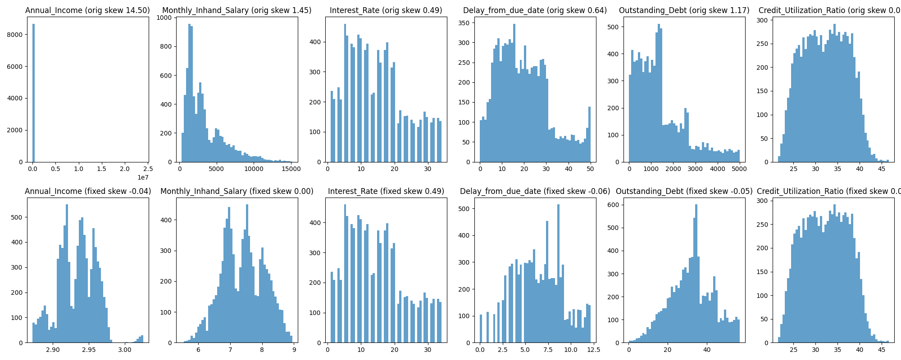
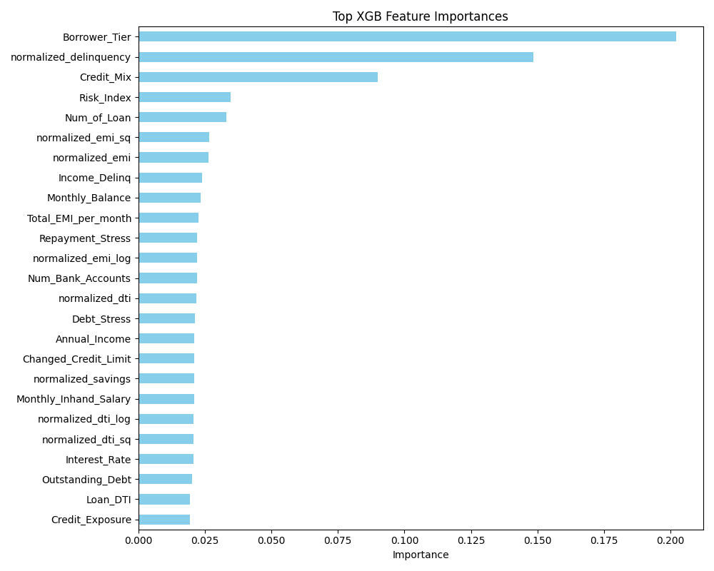
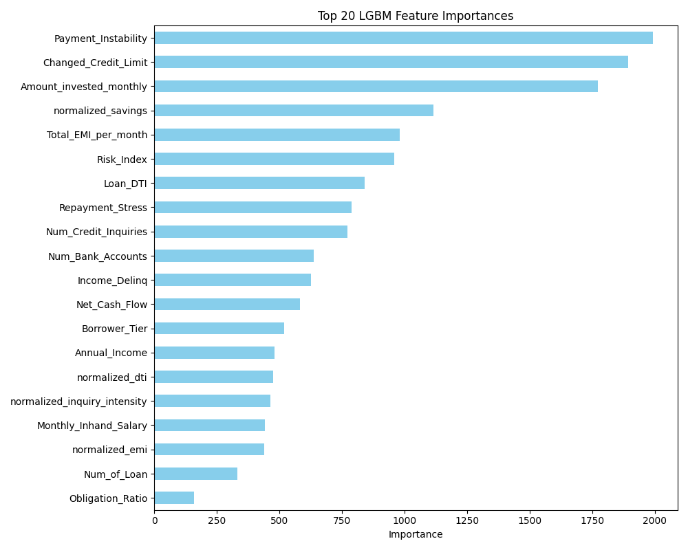
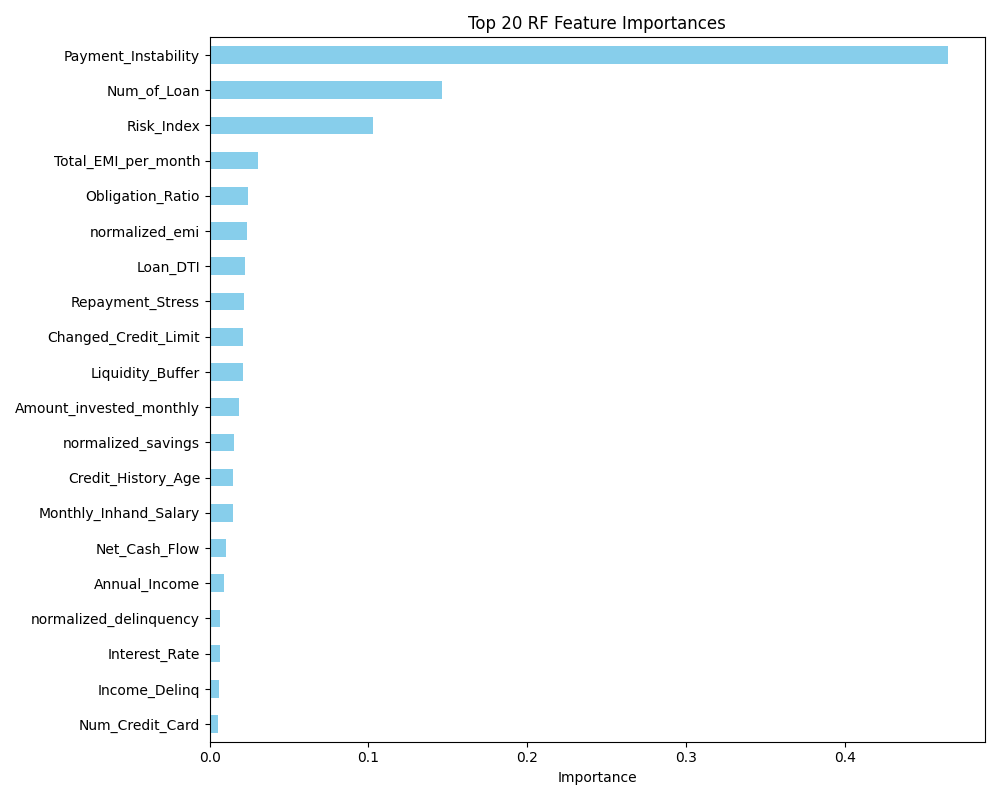
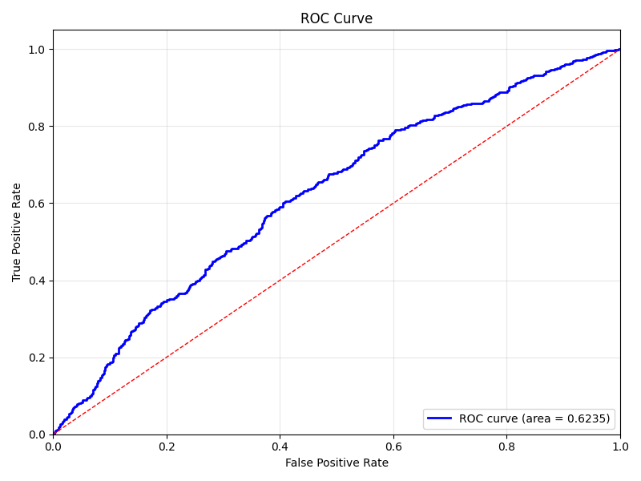
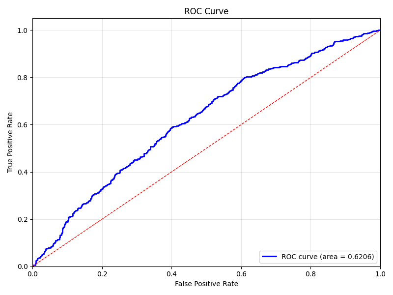
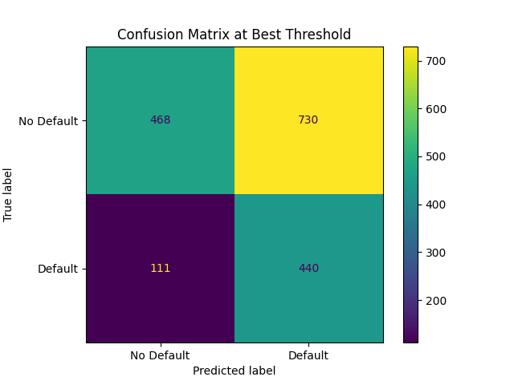
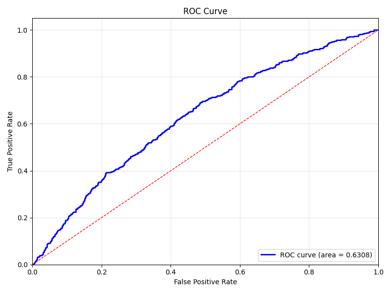
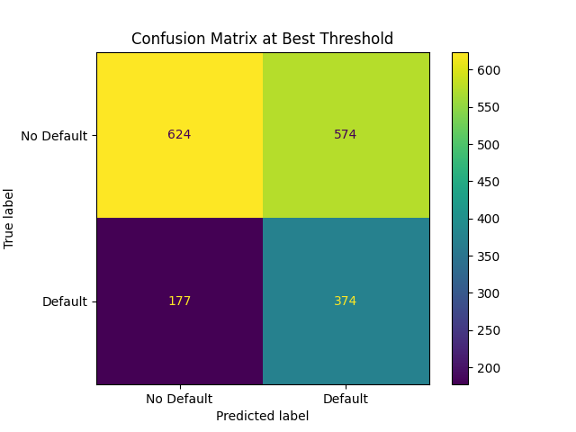

# KingaMetric Risk Analysis Project

This project is a credit-risk and credit-scoring workflow built around tabular borrower data, engineered behavioral features, SQL-based scorecards, Python/XGBoost pipelines, ensemble experiments, serialized models, and Streamlit scoring apps. The repository combines exploratory analysis, preprocessing, rule-based scoring, machine-learning training, and end-user scoring interfaces in one place.

The project centers on predicting `Default_Flag` and converting risk into a borrower-facing score. In the Streamlit ML app, the probability of default is mapped to a FICO-style score with `850 - (risk_prob * 550)`. In the SQL scorecard flow, a normalized composite risk score is mapped to `300 + (Composite_Credit_Risk_Score * 550)`.

## Project Description

The repository contains multiple versions of the credit-risk dataset and several modeling paths:

- A full engineered dataset: `datasets/kingametric_credit_risk.csv` with `8744 x 45`
- A lean dataset: `datasets/kingametric_lean_dataset.csv` with `8744 x 33`
- A schema-locked lean v2 dataset: `datasets/kingametric_lean_v2.csv` with `8744 x 26`

Target balance is consistent across the three saved datasets:

- `Default_Flag = 0`: `5990`
- `Default_Flag = 1`: `2754`

In practice, the repo supports two scoring paradigms:

1. Rule-based SQL scoring from normalized financial ratios
2. Machine-learning scoring from engineered features and trained models

## Project Structure

```text
credit_score/
|-- datasets/                 # Main datasets and archived dataset versions
|-- sql_scripts/              # Rule-based scoring SQL and feature SQL
|-- sql_preprocessing/        # SQL EDA and feature-engineering notebooks
|-- python_preprocessing/     # Python cleaning, wrangling, and preprocessing notebooks
|-- XGB/                      # XGBoost notebook experiments and Optuna tuning
|-- pipelines/                # Main production-style XGB pipelines
|-- ensembles/                # RF/XGB/LGBM/CatBoost stacking experiments
|-- pickled_models/           # Saved trained model objects
|-- streamlit_apps/           # Streamlit apps for ML and SQL scoring
|-- visualizations/           # Saved plots for features, ROC, confusion matrices, skew checks
|-- python_scripts/           # Utility scripts for diagnostics and visualization helpers
`-- requirements.txt          # Core Python package requirements
```

## Data Approaches Used

### 1. Dataset Variants

- `kingametric_credit_risk.csv`: widest engineered dataset, including behavioral and stability-style features
- `kingametric_lean_dataset.csv`: reduced feature set for lighter modeling
- `kingametric_lean_v2.csv`: tighter schema used by the latest schema-locked pipeline

### 2. Feature Engineering

The main XGB pipelines compute normalized behavioral features from raw borrower inputs:

- `normalized_dti`
- `normalized_emi`
- `normalized_delinquency`
- `normalized_credit_history`
- `normalized_savings`
- `normalized_utilization`

Additional interaction and polynomial features are then created, including:

- `Debt_Stress`
- `Repayment_Stress`
- `Liquidity_Index`
- `Credit_Exposure`
- `Risk_Index`
- `Income_Delinq`
- `Loan_DTI`
- squared/log transforms for utilization, DTI, and EMI features

### 3. Leakage Handling

Several files explicitly remove or exclude leaky source columns before training:

- `Payment_Behaviour`
- `Delay_from_due_date`
- `Num_of_Delayed_Payment`

The newer schema-locked pipeline still allows delayed payments as a feature-engineering input, but strips the raw leaky field before model scoring and keeps only the derived signals.

### 4. Encoding and Selection

- Target encoding is used for categorical variables such as `Payment_of_Min_Amount`, `Credit_Mix`, and `Borrower_Tier`
- Mutual information is used for feature selection in the XGB pipelines
- Some ensemble flows use out-of-fold target encoding and additional quartile bucketing such as `Income_Q`

### 5. Thresholding and Evaluation

- Stratified train/test split is used in the main ML pipelines
- ROC AUC is the main ranking metric
- Best threshold is optimized with the KS statistic in the XGB pipelines
- Saved outputs include ROC curves, confusion matrices, and feature-importance charts

## SQL / Rule-Based Approach

The SQL scoring logic in [sql_scripts/final_rule_based_credit_risk_model.sql](/C:/Users/Admin/Documents/PROJECTS/credit_score/sql_scripts/final_rule_based_credit_risk_model.sql) and [sql_scripts/fico_style_improved_rule_based_model.sql](/C:/Users/Admin/Documents/PROJECTS/credit_score/sql_scripts/fico_style_improved_rule_based_model.sql) builds a composite risk score from weighted normalized ratios:

- `(1 - normalized_dti) * 0.25`
- `(1 - normalized_emi) * 0.20`
- `(1 - normalized_delinquency) * 0.20`
- `normalized_credit_history * 0.15`
- `normalized_savings * 0.10`
- `(1 - normalized_utilization) * 0.10`

This score is then translated into:

- Risk categories: `LOW RISK`, `MODERATE RISK`, `HIGH RISK`, `VERY HIGH RISK`
- Credit score bands: `EXCELLENT`, `GOOD`, `FAIR`, `POOR`, `VERY POOR`

## Models Used

### Main ML Models

- XGBoost classifier
- Random Forest classifier
- LightGBM classifier
- CatBoost classifier
- Logistic Regression meta-model for stacking

### Main Pipeline Files

- [pipelines/kingametric_base.py](/C:/Users/Admin/Documents/PROJECTS/credit_score/pipelines/kingametric_base.py)
- [pipelines/kingametric_base_0.py](/C:/Users/Admin/Documents/PROJECTS/credit_score/pipelines/kingametric_base_0.py)
- [ensembles/base_ensemble_0.py](/C:/Users/Admin/Documents/PROJECTS/credit_score/ensembles/base_ensemble_0.py)
- [ensembles/base_ensemble_1.py](/C:/Users/Admin/Documents/PROJECTS/credit_score/ensembles/base_ensemble_1.py)
- [ensembles/base_ensemble_2.py](/C:/Users/Admin/Documents/PROJECTS/credit_score/ensembles/base_ensemble_2.py)

### Saved / Served Model Artifacts

- `pickled_models/kingametric_base_0.pkl`
- `pickled_models/kingametric_xgb_v2_1.pkl`
- `pickled_models/kingametric_xgb_v2_2.pkl`

The main Streamlit XGB app currently loads `pickled_models/kingametric_xgb_v2_1.pkl`.

## Requirements

The repo's [requirements.txt](/C:/Users/Admin/Documents/PROJECTS/credit_score/requirements.txt) includes:

```text
pandas>=1.5.0
numpy>=1.24.0
scikit-learn>=1.3.0
xgboost>=1.7.0
lightgbm>=4.0.0
catboost>=1.2.0
category_encoders>=2.6.0
optuna>=3.3.0
shap>=0.42.0
joblib>=1.3.0
matplotlib>=3.7.0
seaborn>=0.12.0
scipy>=1.10.0
```

Note: the repository also contains Streamlit apps in `streamlit_apps/`, although `streamlit` is not currently pinned in `requirements.txt`.

## Model Scores And Outputs

### Saved XGB Evaluation Artifacts

| Artifact | Source | ROC AUC | Confusion Matrix `(TN, FP, FN, TP)` |
|---|---|---:|---|
| `visualizations/roc_curve.png` + `confusion_matrix.png` | earlier XGB pipeline | `0.6308` | `(624, 574, 177, 374)` |
| `visualizations/roc_curve_lean_v2.png` + `confusion_matrix_lean_v2.png` | lean v2 XGB pipeline | `0.6235` | `(561, 637, 152, 399)` |
| `visualizations/roc_curve_schema_locked.png` + `confusion_matrix_schema_locked.png` | schema-locked XGB pipeline | `0.6238` | `(707, 491, 217, 334)` |

### Additional Notebook Outputs Found In The Repo

| Experiment | File | Saved Output |
|---|---|---|
| Optuna XGB run | `XGB/kingametric_optuna_model_0.ipynb` | `Final AUC 0.6455944315706292` |
| Scripted Optuna XGB run | `XGB/kingametric_optuna_model_scripted.ipynb` | `Test AUC: 0.6333` |
| Scripted Optuna XGB run | `XGB/kingametric_optuna_model_scripted.ipynb` | `Test AUC: 0.6357` |
| Ensemble notebook | `ensembles/ensemble_temp.ipynb` | `Final Test AUC: 0.6355` |
| Ensemble notebook | `ensembles/kingametric_base_ensemble_0.ipynb` | `Final Test AUC: 0.6081` |

### What The Outputs Suggest

- The strongest saved AUC visible in the repo is the Optuna XGB notebook output at about `0.6456`
- The saved ensemble notebook output reaches `0.6355`
- The latest saved schema-locked and lean-v2 XGB artifact images are both in the `0.6235 - 0.6238` range
- Confusion matrices show a recall/precision tradeoff across versions, with some variants favoring more default detection at the cost of more false positives

## Visualizations

### Feature / Distribution Visuals

#### Skew Correction Before vs After



#### XGB Top Features (Schema-Locked)



#### XGB Top Features (Lean V2)


#### LightGBM Top Features



#### Random Forest Top Features



### Scoring Metric Visuals

#### ROC Curve: Schema-Locked XGB



#### Confusion Matrix: Schema-Locked XGB


#### ROC Curve: Lean V2 XGB



#### Confusion Matrix: Lean V2 XGB



#### Earlier XGB ROC / Confusion Outputs





## Observed Feature Patterns From Saved Visuals

- `Borrower_Tier` is the dominant feature in the current saved XGB importance charts
- `normalized_delinquency` is consistently among the strongest XGB features
- `Credit_Mix`, `Risk_Index`, `Num_of_Loan`, and repayment-stress style features repeatedly appear near the top
- In the wider full-feature models, `Payment_Instability` becomes the most dominant feature in the saved LightGBM and Random Forest charts

## Scoring Outputs Exposed In Apps

### ML App Output

The XGB Streamlit app returns:

- Risk probability
- Binary prediction: `Default` or `Safe`
- FICO-style score
- Rating band: `EXCELLENT`, `GOOD`, `FAIR`, `POOR`, `VERY POOR`

See: [streamlit_apps/streamlit_xgb.py](/C:/Users/Admin/Documents/PROJECTS/credit_score/streamlit_apps/streamlit_xgb.py)

### SQL App Output

The SQL Streamlit app returns:

- SQL-generated credit score
- Risk category / rating from weighted normalized ratios

See: [streamlit_apps/streamlit_sql.py](/C:/Users/Admin/Documents/PROJECTS/credit_score/streamlit_apps/streamlit_sql.py)

## Summary

This project is a full credit-scoring experimentation and delivery repository with:

- multiple dataset versions
- SQL and ML scoring approaches
- engineered behavioral, interaction, and polynomial features
- XGBoost and ensemble modeling
- saved trained artifacts
- embedded feature and evaluation visuals
- Streamlit interfaces for live scoring

Among the artifacts currently stored in the project, the best visible score is the Optuna-tuned XGB notebook output (`AUC ≈ 0.6456`), while the latest saved deployment-style XGB artifact images sit around `AUC ≈ 0.624`.
